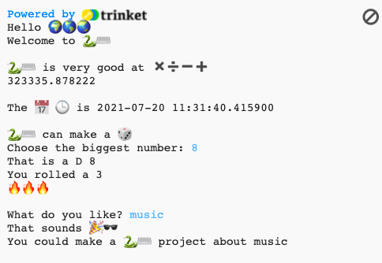

## You will make

Find out what the Python programming language can do by writing an interactive project that uses emoji.

**Emoji** are small colourful images used to add extra meaning to messages. Emoji means 'picture word' in Japanese.

You will:
+ `print()` text, including emoji, and get `input()` from the user
+ Store text and numbers in **variables**
+ Use **functions** to organise your code

--- no-print ---

### Play ▶️

--- task ---

  
Read the output and then tap <kbd>Enter</kbd> to continue. 
Type in your answers to the questions. Can you see how your answers are used?

  <iframe src="https://trinket.io/embed/python/a54e164ac2?outputOnly=true&start=result" width="600" height="500" frameborder="0" marginwidth="0" marginheight="0" allowfullscreen>
  </iframe>
  

--- /task ---

--- /no-print ---

--- print-only ---

--- /print-only ---
