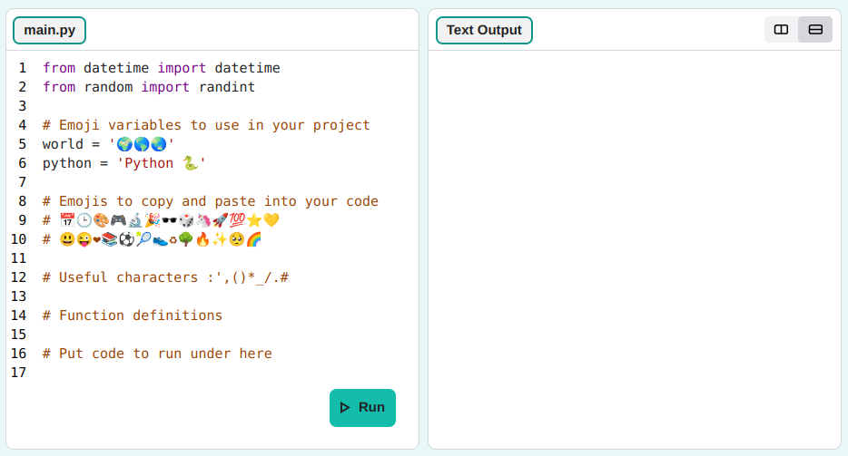
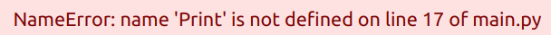
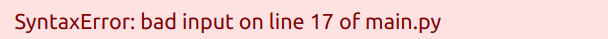

## Say hello 🌍🌎🌏

Make your program say Hello world.

{:width="200px"}

--- task ---

<mark>Starter link no longer working. Tried removing python from path. Still not working.</mark>

Open the [starter project](https://editor.raspberrypi.org/hello-world-starter){:target="_blank"}. The Code Editor will open in another browser tab.

{:width="640px"}

--- /task ---

### Print hello

Lines beginning with a `#` are **comments**. They explain what the code will do. Comments are ignored by Python.

--- task ---

**Find:** the `# Put code to run below here` comment.

Click below that line. 

The flashing `|` is the cursor and shows where you will type.

--- /task ---

--- task ---

Type the code to `print()` Hello to the screen.

**Tip:** When you type an opening bracket `(` or opening `'` the code editor will automatically add closing bracket `)` or `'`:

--- code ---
---
language: python
filename: main.py
line_numbers: true
line_number_start: 16
line_highlights: 17
---
# Put code to run under here    
print('Hello')

--- /code ---

--- collapse ---
---
title: Typing special characters on a UK or US keyboard
---

On a UK or US keyboard, the left `(` and right `)` round brackets are on the <kbd>9</kbd> and <kbd>0</kbd> keys. To type a left round bracket, hold down the <kbd>Shift</kbd> key (next to <kbd>Z</kbd>) and then tap <kbd>9</kbd>.
The single quote `'` is on the same row as the <kbd>L</kbd> key, just before the <kbd>Enter</kbd> key.
The comma `,` is next to the <kbd>M</kbd>.

--- /collapse ---

--- /task ---

--- task ---

**Test:** Click on the **Run** button at the bottom of the code editor to run your code. The output will appear on the right:

--- /task ---

--- task ---

**Debug:** If you get an error then check your code really carefully. 

+ **Fix:** Check that you have a lowercase `p` in `print`
+ **Fix:** Check that you have single quotes `''` around `'Hello'`

+ **Fix:** Check that you have used brackets around `('Hello')`

--- /task ---

## Print 🌍🌎🌏

A **variable** is used to store values that you want to use later in your code. Choosing a sensible name for a variable makes it easier for you to remember what it is for.

--- task ---

**Find:** the comment `# Emoji variables to use in your project`.

We have included some variables that store emojis.

--- code ---
---
language: python
filename: main.py
line_numbers: true
line_number_start: 
line_highlights: 
---

# Emoji variables to use in your project
world = '🌍🌎🌏'
python = 'Python 🐍'

--- /code ---

--- /task ---

--- task ---

**Add** a comma `,` and the variable name `world` into your `print('Hello')` line of code. 

This will `print()` the string (text) `Hello` and the 'world' variable (three world emojis 🌍🌎🌏).

--- code ---
---
language: python
filename: main.py
line_numbers: true
line_number_start: 16
line_highlights: 17
---

# Put code to run under here    
print('Hello', world) 

--- /code ---

--- /task ---

--- task ---

**Test:** Run your code to see the result:

**Tip:** Emoji can look different on different computers, so yours might not look exactly the same.

--- collapse ---
---
title: I have a syntax error
---

Make sure that you have added a comma `,` between the items in `print()` and that you have spelled `world` correctly.

This example is missing the comma `,`. It's small but very important!

--- /collapse ---

--- /task ---

--- task ---

**Add** another line to your code to `print()` more text and emojis:

--- code ---
---
language: python
filename: main.py
line_numbers: true
line_number_start: 17
line_highlights: 18
---
print('Hello', world)    
print('Welcome to', python) 

--- /code ---

**Tip:** The line you need to type is highlighted above in a lighter colour. Code that is not highlighted helps you find where you need to add the new code.

--- /task ---

--- task ---

**Test:** Click **Run**. 

**Tip:** It's a good idea to run your code after every change so you can fix problems quickly.

--- collapse ---
---
title: I have a syntax error
---

Check carefully for brackets, quotes, commas, and correct spelling. Python needs you to be really accurate.

--- /collapse ---

--- /task ---

--- task ---

<mark>Do you need to name the project? This flow doesn't seem to be working at the moment with the starter project url so haven't been able to check.</mark>

**Save** your project by clicking on the 'Save' button.

If you don't have a Raspberry Pi Foundation account, you can still come back to your project in the future on the same computer and web browser. You can also click 'Download' to save your project to your computer. This will create a '.zip' file containing the code from your project.

--- /task ---

