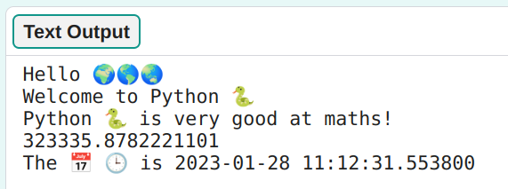

## Calculations and dates

Get Python to do a calculation for you and also get the current time and date. 

{:width="350px"}

In Python you can use operators to do calculations:

<table >
  <tr>
    <td>+</td>
    <td>add</td>
  </tr>
  <tr>
    <td>-</td>
    <td>subtract</td>
  </tr>
  <tr>
    <td>*</td>
    <td>multiply</td>
  </tr>
  <tr>
    <td>/</td>
    <td>divide</td>
  </tr>
  <tr>
    <td>**</td>
    <td>to the power</td>
  </tr>
</table>

 

  <a class="c-survey-banner__link" href="https://form.raspberrypi.org/4873313">Take our survey</a> to help make our Code Editor better!

### Create a calculation

--- task ---

Add another two `print()` lines to your code with a calculation for Python to work out:

**Tip:** To get a `*` symbol press <kbd>Shift</kbd> and <kbd>8</kbd> at the same time.

--- code ---
---
language: python
filename: main.py
line_numbers: true
line_number_start: 17
line_highlights: 19-20
---
print('Hello', world)   
print('Welcome to', python)   
print(python, 'is very good at maths!')   
print(230 * 5782 ** 2 / 23781) # Print the result of the sum    

--- /code ---

**Tip:** You don't need to type the comments, they are just there to help you understand the code. Just type the code before the `#`.

--- /task ---

--- task ---

**Test:** Run your code. Did Python calculate the answer correctly? Only joking 😆! Python is great at calculations so you don't need to work it out.

**Debug:**

--- collapse ---
---
title: I have a syntax error
---

Make sure that you have added a comma `,` between the items in `print()` and that you have spelled `python` correctly.

--- /collapse ---

--- /task ---

Japanese computer scientist **Emma Haruka Iwao** used a computer to calculate the value of Pi (*π*) to 100 trillion digits. That answer is so long that it would take hundreds of thousands of years just to say it! 

--- task ---

Try changing the code so that Python has to do an even more difficult calculation! Can you crash the editor?

--- /task ---

--- task ---

**Test:** Run your code and see Python answer your calculation.

**Debug:** 

--- collapse ---
---
title: I have a syntax error
---

Make sure your calculation has round brackets around it `(2 * 45)`. If you use extra brackets to control the order, make sure you have a right bracket to match every left bracket.

--- /collapse ---

--- /task ---

### Print the current time and date

The line `from datetime import datetime` at the top of your code imports a library with helpful functions for getting the current date and time.

One of the great things about Python is all the **libraries** of code that are available to use. A Python library allows you to easily use code that other people have written. There are libraries for drawing charts and graphs, making art, doing calculations, and lots more.

--- task ---

**Find:** The `import` lines at the top of your code. They tell Python that you are going to use code you didn't write.

--- code ---
---
language: python
filename: main.py
line_numbers: true
line_number_start: 1
line_highlights: 1-2
---

from datetime import datetime
from random import randint

--- /code ---

--- /task ---

--- task ---

Add another line to your code to `print` some more text and the emojis for `calendar` and `clock`.

Get the current date and time by using `datetime.now()`.

<mark>It's very hard to add code if you have a small screen and font size medium as the run button is in the way and the line before is long. There's no way to click under the code on the left in the editor and get a new line.</mark>

--- code ---
---
language: python
filename: main.py
line_numbers: true
line_number_start: 19
line_highlights: 21
---

print(python, 'is very good at maths!')     
print(230 * 5782 ** 2 / 23781) # Print the result of the sum     
print('The 📅 🕒 is', datetime.now()) # Print with emojis    
 
--- /code ---

**Tip:** To add emojis, find the comment `# Emojis to copy and paste into your code` and copy the emojis you want to use then paste them into your code. 

[[[choose-an-emoji]]]

--- /task ---

--- task ---

**Test:** Run your code a couple of times to see the date and time update.

**Debug:** Check that you have a fullstop `.` between `datetime` and `now`. Check all the punctuation carefully.

--- /task ---

--- task ---

If you are logged in to your Raspberry Pi Foundation account, and have already clicked 'Save', the Code Editor will automatically save your project when you make changes. You can also click the 'Save' button at any time. 

<mark>Double check that you have to click Save</mark>

**Tip:** If you get logged out of your account then your code will still be saved if you have clicked 'Save'.

--- /task ---
