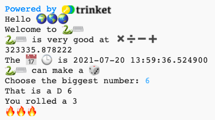

## Roll a dice

Python can generate random numbers to make digital dice.

{:width="300px"}

In Python you **call** a **function()** to perfom an action. You have already used the `print()` function to output text.

You can **define** a new **function** to group code together so that you can name it and reuse it. 

--- task ---

Functions need to be defined before you can call them. Look for the comment near the top of the **main.py** tab that says `#Put function definitions under here`.

Define a new function called `roll_dice()` that uses the `randint()` function, from the `random` library, to generate a random 'integer' (whole number) from 1 to 6 and output it to the screen.

--- code ---
---
language: python
filename: main.py
line_numbers: true
line_number_start: 7
line_highlights: 9-12
---

#Put function definitions under here

def roll_dice(): #Don't forget the colon at the end of this line   
  print(python, 'can make a', dice)   
  print('You rolled a', randint(1, 6))    

--- /code ---

The lines under `def roll_dice():` are **indented**. To do this, use the <kbd>Tab</kbd> character on your keyboard (usually above <kbd>CAPSLOCK</kbd> on the keyboard). Indenting code tells Python that the indented lines are part of the function.

**Tip:** The underscore `_` is used to between words in variable and function names in Python to make them easier to read. You can't use a space. 

--- collapse ---
---
title: Typing special characters on a UK or US keyboard
---

On a UK or US keyboard, the colon `:` is on the same key as the semicolon, next to the <kbd>L</kbd> key: hold <kbd>Shift</kbd> and tap <kbd>;</kbd> to type a `:`.
  The underscore `_` is on the same key as the `-`, next to the <kbd>0</kbd>, hold <kbd>Shift</kbd> and tap <kbd>-</kbd> to type an `_`.

--- /collapse ---

--- /task ---

--- task ---

**Test:** If you ‘Run’ your code now, it won't roll a dice. That’s because you have defined the `roll_dice()` function, but not called it yet.

--- /task ---

--- task ---

To use a function, you need to call it in the code. Go to the end of your code and add a new line to call the `roll_dice()` function:

--- code ---
---
language: python
filename: main.py
line_numbers: true
line_number_start: 20
line_highlights: 22
--- 

print('The', calendar, clock, 'is', datetime.now())

roll_dice() #Call the roll dice function

--- /code ---

--- /task ---

--- task ---

**Test:** Run your project several times to see the random dice roll each time. 

**Debug:** Make sure you have an underscore `_` between roll and dice to make the function name. Make sure you have a colon `:` at the end of the line.

**Debug:** Check that the lines under `def roll_dice()` are indented. It's really common to get this wrong in Python, so make sure to check.

--- /task ---

Uses of random numbers include cryptography, data science, and adding variety into games and computer art. Computers generate **random numbers** using an algorithm. For numbers that are really random, you need an unpredictable input from the real world.

--- task ---

The `fire` variable stores a 🔥 emoji. The code `print(fire * 3)` outputs three fire emoji '🔥🔥🔥'. You need to output the correct number of emoji to match the number rolled. 

--- collapse ---
---
title: What would happen if you use `print(fire * randint(1, 6))`? 
---

You would get a new random number that is usually different from your first random number. 

--- /collapse ---

Hmm, how can you make sure you use the same random number?

Change your code to save the value returned by `randint()` in a variable called `roll` and then use that variable to print out the number rolled with the matching number of 🔥 emoji.
 
--- code ---
---
language: python
filename: main.py
line_numbers: true
line_number_start: 7
line_highlights: 11 - 13
---

#Put function definitions under here

def roll_dice():    
  print(python, 'can make a', dice)    
  roll = randint(1, 6) #Generate a random number between 1 and 6    
  print('You rolled a', roll) #Print the value of the roll variable     
  print(fire * roll) #Repeat the fire emoji to match the dice roll    

--- /code ---

You can use `star` or `heart` instead of `fire` if you prefer.

The symbol `*` means multiply so `fire * roll` multiples the text in the `fire` variable ('🔥') by the number contained in the `roll` variable.

--- /task ---

--- task ---

**Test:** Test your project a few times. Make sure you understand how the code works. 

**Tip:** Variables are useful when you need to use the same value multiple times in your code. Giving variables a sensible name also makes your code easier to understand.

--- /task ---

Upgrade your dice so that the user can choose the maximum number. 

Lots of games use many-sided dice. In the physical world, dice are made from regular geometric shapes. Common dice include D6, D12, and D20. On a computer, you can generate a random number to make a fair dice with any number of sides.

--- task ---

The `input()` function asks the user a question and then returns their answer.

Add code to ask the user for the biggest number on their dice and then save the result in a variable called `max` and `print` the number chosen into the output area: 

--- code ---
---
language: python
filename: main.py
line_numbers: true
line_number_start: 7
line_highlights: 11-12
---

#Put function definitions under here

def roll_dice():   
  print(python, 'can make a', dice)   
  max = input('How many sides?:') #Wait for input from the user    
  print('That\'s a D', max) #Use the number the user entered    
  roll = randint(1, 6)    
  print('You rolled a', roll)    
  print(fire * roll)     

--- /code ---

To print an apostrophe `'` in a word like `That's`, put a backslash `\` before it so Python knows it's part of the text.

--- /task ---
  
--- task ---

Change your `roll` variable code to use `max` as the maximum value for `randint` when it generates a random number. 

When you get input from the user, Python treats it as text. But, `randint` needs an 'integer' (a positive whole number). The `int` function turns the user input into an integer.

--- code ---
---
language: python
filename: main.py
line_numbers: true
line_number_start: 7
line_highlights: 13
---

#Put function definitions under here

def roll_dice():   
  print(python, 'can make a', dice)   
  max = input('How many sides?:') #Wait for input from the user   
  print('That\'s a D', max) #Use the number the user entered   
  roll = randint(1, int(max)) #randint needs max to be an 'integer'   
  print('You rolled a', roll)   
  print(fire * roll)   
  
--- /code ---

--- /task ---

--- task ---

**Test:** Run your project. When the program reaches the `input` line, it will wait for you to enter a response before continuing. Try it again with a different `input` number. 

--- /task ---

--- save ---
