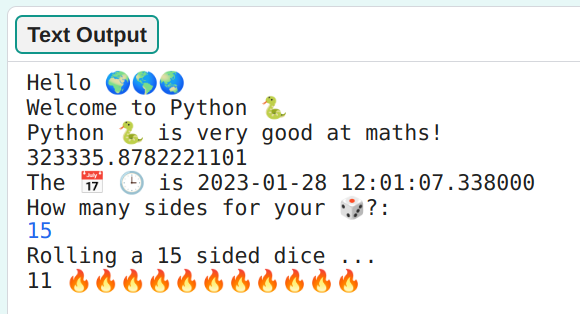

## Roll a dice 🎲

Create a function for rolling a dice using random numbers. 
  
In Python:
  - **functions**, defined with `def`, are like 'my blocks' in Scratch,
  - `randint` is like 'random' in Scratch, and
  - `input` is like 'ask' in Scratch.

{:width="350px"}

A **function** can be created in Python to perform an action. You have already used a function called `print()` to display messages on the screen.

  <a class="c-survey-banner__link" href="https://form.raspberrypi.org/4873313">Take our survey</a> to help make our Code Editor better!

### Define your function

--- task ---

Define a function called `roll_dice()`.

--- code ---
---
language: python
filename: main.py
line_numbers: true
line_number_start: 14
line_highlights: 15
---
# Function definitions
def roll_dice(): 

# Put code to run under here
print('Hello', world)
--- /code ---

**Tip:** Remember that the code editor adds the closing bracket `)` for you. Use the right arrow to move your cursor to the end of the line then type the colon `:`.

**Tip:** An underscore `_` is used between words in variable and function names in Python to make them easier to read. You can't use a space. 

--- collapse ---
---
title: Typing special characters on a UK or US keyboard
---

On a UK or US keyboard, the colon `:` is on the same key as the semicolon, next to the <kbd>L</kbd> key: hold <kbd>Shift</kbd> and tap <kbd>;</kbd> to type a `:`.
  The underscore `_` is on the same key as the `-`, next to the <kbd>0</kbd>, hold <kbd>Shift</kbd> and tap <kbd>-</kbd> to type an `_`.

--- /collapse ---

--- /task ---

--- task ---

Press <kbd>Enter</kbd> after your colon `:` to add the code for your function. Your cursor should be indented within the function. 

**Add** the code to print `You rolled` and then display a **random number** between 1 and 6.

--- code ---
---
language: python
filename: main.py
line_numbers: true
line_number_start: 14
line_highlights: 16
---
# Function definitions
def roll_dice(): # Don't forget the colon at the end of this line   
    print('You rolled', randint(1, 6))    

--- /code ---
 
--- /task ---

--- task ---

**Test:** Run your code to check for errors. It won't roll a dice yet.

**Debug:** 

--- collapse ---
---
title: I have a syntax error 
---

- Make sure you have an underscore `_` between roll and dice to make the function name. 

- Make sure you have a colon `:` at the end of the line.

- Check that the lines under `def roll_dice()` are indented. It's really common to get this wrong in Python, so make sure to check.

--- /collapse ---

--- /task ---

### Call your function

--- task ---

To use a function, you need to **call** it in the code. Go to the end of your code and add a new line to call the `roll_dice()` function:

--- code ---
---
language: python
filename: main.py
line_numbers: true
line_number_start: 23
line_highlights: 25
--- 
print('The 📅 🕒 is', datetime.now()) # Print with emojis 

roll_dice() # Call the roll dice function

--- /code ---

**Tip:** Python ignores blank (empty) lines so you can add them to make your code easier to read.

--- /task ---

--- task ---

**Test:** Run your project several times to see the random dice roll each time. 

--- /task ---

Uses of random numbers include cryptography, data science, and adding variety into games and computer art. Computers generate **random numbers** using an algorithm. For numbers that are really random, you need an unpredictable input from the real world.

### Use 🔥🔥🔥 for the number rolled

--- task ---

**Change** your function code to save the value returned by `randint()` in a variable called `roll`.
 
--- code ---
---
language: python
filename: main.py
line_numbers: true
line_number_start: 14
line_highlights: 16 - 17
---
# Function definitions
def roll_dice():    
    roll = randint(1, 6) # Generate a random number between 1 and 6    
    print('You rolled a', roll) # Print the value of the roll variable        

--- /code ---

--- /task ---

--- task ---

Add code to print out a number of '🔥' emojis to match the number on the dice. You can use a '❤️' or '⭐' emoji if you prefer.

--- code ---
---
language: python
filename: main.py
line_numbers: true
line_number_start: 14
line_highlights: 18
---
# Function definitions

def roll_dice():      
    roll = randint(1, 6) # Generate a random number between 1 and 6    
    print('You rolled', roll) # Print the value of the roll variable     
    print(roll, '🔥' * roll) # Repeat the fire emoji to match the dice roll  

--- /code ---

--- /task ---

--- task ---

**Test:** Test your project a few times. 

--- /task ---

### Choose the number of sides on the dice

--- task ---

The `input()` function asks the user a question and then returns their answer.

**Add** code to ask the user for the biggest number on their dice and then store the result in a variable called `max` and `print` the number chosen: 

--- code ---
---
language: python
filename: main.py
line_numbers: true
line_number_start: 14
line_highlights: 16-17
---
# Function definitions
def roll_dice():      
    max = input('How many sides for your 🎲?: ') # Wait for input from the user    
    print('Rolling a', max, 'sided dice ...') # Use the number the user entered    
    roll = randint(1, 6)    
    print('You rolled a', roll)    
    print(roll, '🔥' * roll) # Repeat the fire emoji to match the dice roll  
     
--- /code ---

--- /task ---
  
--- task ---

Change your `roll` variable code to use `max` as the maximum value for `randint` when it generates a random number. 

When you get input from the user, Python treats it as text. But, `randint` needs an 'integer' (a positive whole number). The `int` function turns the user input into an integer.

--- code ---
---
language: python
filename: main.py
line_numbers: true
line_number_start: 14
line_highlights: 18
---
# Function definitions
def roll_dice():   
    max = input('How many sides?:') # Wait for input from the user   
    print('Rolling a', max, 'sided dice ...') # Use the number the user entered 
    roll = randint(1, int(max)) # randint needs max to be an 'integer'   
    print('You rolled a', roll)   
    print(roll, '🔥' * roll) # Repeat the fire emoji to match the dice roll    
  
--- /code ---

--- /task ---

--- task ---

**Test:** Run your project. When the program reaches the `input` line, it will wait for you to enter a response before continuing. Try it again with a different `input` number. 

--- /task ---
