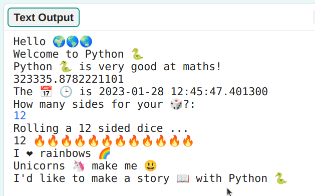

## Sentence starter

Output more sentences from your project.

{:width="350px"}

--- task ---

Add more `print` lines to your code. Here are some sentence starters that you can use:

--- code ---
---
language: python
filename: main.py
line_numbers: true
line_number_start: 29
line_highlights: 29-32
---
roll_dice() # Call the roll dice function
print('I ❤️ ...')   
print('... makes me 😃')   
print('I\'d like to make ... with', python)   

--- /code ---

**Tip:** To print an apostrophe `'` in a word like `That's`, put a backslash `\` before it so Python knows it's part of the text.

**Tip:** `print` adds a space between each item you print. 

**Tip:** Add a `#` at the beginning of a line to turn it into a comment.

--- /task ---

The yellow heart emoji 💛 is often used to show friendship and happiness.

--- task ---

What message would you send to a friend to cheer them up? Which emoji would you choose?

**Tip:** The starter projects include emojis in comments. Copy the emojis you want to use then paste them into your code. 

📅🕒🎨🎮🔬🎉🕶️🎲🦄🚀💯⭐💛 😃😜❤️📚⚽🎾👟♻️🌳🔥✨🥺🌈

[[[choose-an-emoji]]]

--- /task ---
