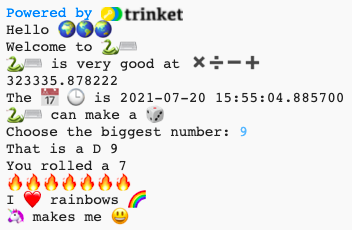

## Sentence starter

Output more sentences from your project.

{:width="300px"}

--- task ---

Add more `print` lines to your code. Here are some sentence starters that you can use:

--- code ---
---
language: python
filename: main.py
---

print('I', heart, '...')   
print('... makes me', happy)   
print('I\'d like to make ... with', python)   

--- /code ---

**Tip:** `print` adds a space between each item you print. 

**Tip:** If you need to print an apostrophe `'` then you need to put a backslash `\` before it so Python knows it's part of the text. 

--- /task ---

The yellow heart emoji is often used to show friendship and happiness.

--- task ---

What message would you send to a friend to cheer them up? Which emoji would you choose?

Click on the **emoji.py** tab in Trinket to see the emoji variables that you can use. Click back on the **main.py** tab to add to your code.

You can add more emoji variables to **emoji.py**. Use this [emoji list](https://unicode.org/emoji/charts/full-emoji-list.html){:target="_blank"} to find the ones you want. 

--- /task ---

--- save ---
