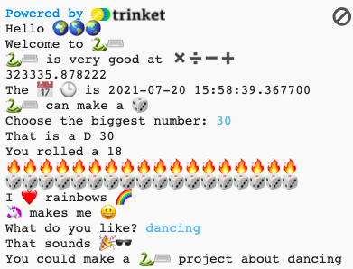

## Upgrade your project

Add more to your project. There are more emoji to choose from.
  

{:width="300px"}

You could:
+ Use `print` with different text and emoji
+ Use `input` to get values from the user and store them as variables, then do sums with the variables
+ Write more functions to organise your code
+ Use `#` to add comments to your code

Click on **emoji.py** to see the emoji variables that you can use. Click back on **main.py** to add to your code.

Here's an example function that asks about hobbies:

--- code ---
---
language: python
filename: main.py
---

#Put code to run under here    
def hobbies():   
  hobby = input('What do you like?')   
  print('That sounds', fun)   
  print('You could make a', python, 'project about', hobby)   

--- /code ---

**Tip:** Don't forget you will need to call your function as well as define it.

You can use `input` to make your project wait for the user to tap <kbd>Enter</kbd> at any point in this project.

--- code ---
---
language: python
filename: main.py
---

roll_dice()

input() #Wait for the user to tap Enter

hobbies()

--- /code ---

--- collapse ---
---
title: Completed project
---

You can view the [completed project here](https://trinket.io/embed/python/a54e164ac2){:target="_blank"}.

--- /collapse ---

--- save ---
